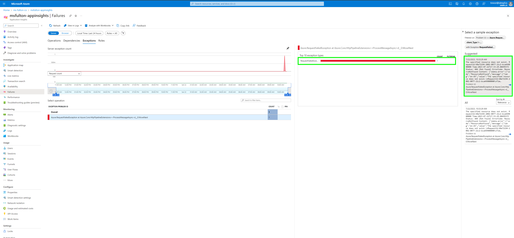
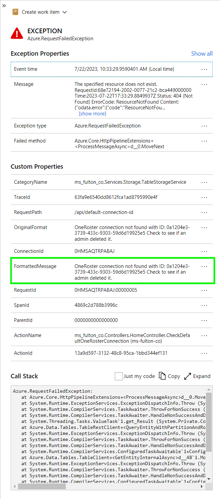
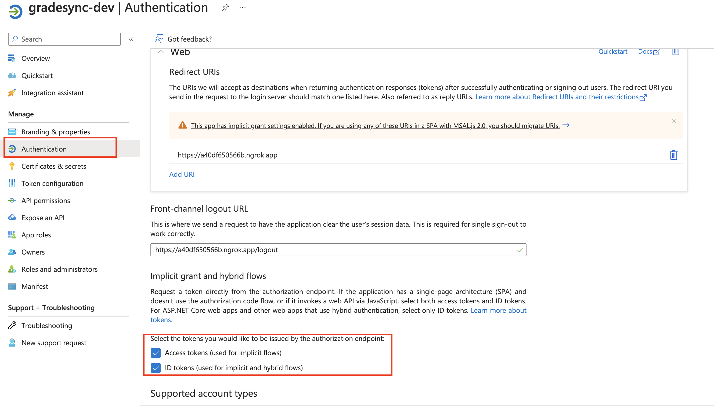

# Grade Sync Teams app for Microsoft Teams Assgnments

## How to deploy

To deploy, first install Azure CLI if you don't already have it using `brew update && brew install azure-cli`. Then run `az login` to login to the account you
wish to deploy to. **Before running** the deploy, change **all** the resource name prefixes from `default` to something unique in `infrastructure/azuredeploy.parameters.json` and save the file.

Change directory to the project root, and run the following command to run all the deploy scripts `pwsh infrastructure/azuredeploy.ps1`.

When the script runs you will be prompted a few times for the subscription name, region, etc. After it's done running you should see all necessary resources created in the resource group you specified (or the default resource group if you didn't specify one). The script will also attempt to deploy the web app and azure function, but if
there are any issues with the deployments (project may build/zip-deploy differently depending on OS, or if you are running in a CI/CD pipeline etc) you can also deploy from Visual Studio, and simply select the resources created from the ARM deploy.

Next, you need to create an Active Directory App Registration [following the steps below](#setup-active-directory-auth). Ensure you also follow the
steps to [add graph scopes](#add-graph-api-configuration) as well. At this point everything on the Azure side is created, now you just need to populate configuration settings for both the App Service and Azure Function, and then create the Teams app manifest.

### Populate configuration settings

Navigate to the App Service resource and go to the **Configuration** tab. You need to create **Application settings** for connection strings, active directory, and few other values. Create the following keys/values, and make sure to toggle on **Deployment slot setting** for each of them:

1. `StorageConnectionString`: `<your-storage-connection-string>` Find the connection string by going to the **defaultgradesyncstorage** storage account resource, **Access keys**, and copy one of the connection strings.
1. `APPLICATIONINSIGHTS_CONNECTION_STRING`: `<your-appinsights-connection-string>` Find this by going to the **default-ai-gradesync-prod-useast2** App Insights resource, and copying the **Connection String** at the top of the **Overview** page.
1. `AzureAd__Instance`: `https://login.microsoftonline.com/`
1. `AzureAd__ClientId`: `<your-ad-app-client-id>` Find your client ID by going to your Active Directory App registration you created, and copy **Application (client) ID** at the top of the **Overview** tab.
1. `AzureAd__TenantId`: `common`
1. `AzureAd__Audience`: `<your-ad-app-client-id>` This is the same value as the client ID above
1. `AzureAd__ClientSecret`: `<your-ad-client-secret>` Find your client secret by going to your Active Directory App registration you created, and go to **Certificates & secrets > Client secrets**. You
can only copy the secret once when you create it. Additionally, make sure to copy the *Value* of the secret and **NOT** the Secret ID.
1. `EncryptionKey`: `<base64-encoded-32-byte-key>` You can create this key in an external key generator, or You can generate a secure random key natively
in .NET by running the test `CanEncryptAndDecryptText()`, and copy the key which is output to the console.
1. `VendorAuthHeader`: `<x-vendor-authorization-header-key>` This variable is optional, and is only needed if your OneRoster API connection requires you to send a vendor-specific static auth key along with the request.
1. `MatchEmailOneRoster`: `true` or `false` This setting controls how OneRoster accounts are returned for the Mapping Tool. When set to `true`, and a user attempts to link their Microsoft account to a OneRoster account, only accounts that have a matching email will be available as an option. If set to `false` (or you omit this variable)
it will not attempt to match by email and will instead return *all* accounts for the OneRoster connection.
1. `MappingToolDisabled`: `true` or `false` This setting controls whether the mapping tool for external IDs will be available as a feature. Set to `true` if you are using SDS and **never** want teachers nor admins to manually change the external ID of a teacher, student, or class. To enable the mapping tool, set to `false` or omit this environment variable.
1. Click **Save** at the top of the **Configuration** page which will restart your app to apply the new config values.

Now you need to create configuration settings for the Azure Function, and they are mostly the same values as the App Service settings above since most resources are shared between both runtimes. Navigate to the Function App (which is named **default-as-gradesyncworker-prod-useast2**) and go to **Configuration**.

Create the following **Application settings**:

1. `StorageConnectionString`: Use the same connection string as the app service above
1. `ClientId`: `<your-ad-app-client-id>` This is the same AD client ID from above
1. `ClientSecret`: `<your-ad-client-secret>` This is the same AD client secret from above
1. `EncryptionKey`: `<base64-encoded-32-byte-key>` The same encryption key from above (these **must match**)
1. `VendorAuthHeader`: `<x-vendor-authorization-header-key>` The same optional auth header from above, if you configured one
1. Click **Save** at the top of the **Configuration** page which will restart your app to apply the new config values.

You should now have all environment variables populated for both the App Service and the Azure Function.

### Additional Azure Function settings

Navigate to the Azure Function and go to **Configuration > General Settings** and change the **.NET Version** setting to `.NET 7 Isolated`.

> **Note**
> You can also link Application Insights to capture error logs from the Azure Function. Navigate to the **Application Insights** tab in the function app, and
> follow the instructions to link to the Application Insights resource created during the deployment. Alternatively, you can create a new App Insights resource
> if you don't want both Web App and Azure Function logs going to the same place.

### Build Teams manifest

Follow the instructions below to [build the manifest](#create-a-teams-app), but instead of using the ngrok urls, you use the actual URL of the App Service.
This is listed at the top of the App Service under **Default domain** and will look something like `<your-prefix>-as-gradesyncapi-prod-useast2.azurewebsites.net`.

The app is ready to run and you just need to import/install the manifest.zip in Teams.

### Debugging and diagnosing deployment issues

The easiest way to debug issues with the App Service is to navigate to **Log stream** which will give you live output from the container running the app.

Most errors in the application that aren't application-wide errors are caught and logged to Application Insights. Things like broken Graph API connections, storage connections not working, OneRoster issues, will all be caught here.

To see exceptions easily, go to the Application Insights resource and click on **Failures** under the **Investigate** menu on the left. Then click on the **Exceptions** tab at the top. You can also filter by time at the top depending on how much you want to see.

Clicking on a specific exception in **Top 10 exception types** will open the **Select a sample exception** on the right, where you can see individual exceptions that occured.

Clicking on an individual exception will open details for it. This includes the original exception, stack trace, the API endpoint it occured during, and other data. In many cases the **FormattedMessage** property will contain a useful message describing what happened in the context of the business logic of the application.

## MacOS local dev

[Install Visual Studio](https://visualstudio.microsoft.com/vs/mac/)

Ensure you have Node and Npm installed locally. You may need to add a symlink for both of them if you get build errors:

1. `ln -s "$(which node)" /usr/local/bin/node`
1. `ln -s "$(which npm)" /usr/local/bin/npm`

To run the **grade-sync-api** project, first you need to populate the `secrets.json` file with environment variables. This is a native Visual Studio file automatically excluded from version control.
Access this file by right cicking the the **grade-sync-api** project and select **Manage User Secrets** which will open `secrets.json`. Populate it with the necessary environment variables shown in
the example `secrets.example.json`.

The **grade-sync-worker** Azure Function project uses the same environment variables, and for running this locally you need to create a file `local.settings.json` under **grade-sync-worker**,
following the example file `local.settings.example.json`.

> **Note**
> The environment variable `EncryptionKey` must be a base64-encoded 32 byte length key. You can generate a secure random key natively in .NET by running the test `CanEncryptAndDecryptText()`, and copy the key which is output to the console.

### Create Azure resources for local dev

The only Azure resource you need to create for local dev is a storage account if you don't already have one setup to use. You get the connection string to use as the `StorageConnectionString`
environment variable under the **Access Keys** menu in the storage account.

For new storage accounts, you also need to create a queue. Under the **Queues** menu, create a new queue named `one-roster-gradesync`.

## Create a Teams app

1. To setup your own Teams app for local dev, you first need to setup an ngrok tunnel to the app running on localhost. Follow the [instructions](https://ngrok.com/docs/getting-started/) to setup an ngrok account and the ngrok CLI if you don't already have them.

1. Run `ngrok http 44420` and copy the forwarding url which is in the form **https://your-subdomain.ngrok.app**.

1. Create `TeamsAppManifest/manifest.json` by copying `TeamsAppManifest/manifest.example.json`, change all instances of `<baseUrl>` to your ngrok forwarding url from above, also change `<Your Name>`, and change the `id` field to a new unique GUID, and save the file. 

> **Note**
> If you are doing a deploy, create `manifest.json` by using `manifest.deploy.example.json` as a guide, using the actual App Service domain for your URL values.

Next, in a terminal/shell, `cd TeamsAppManifest` and run `chmod +x buildManifest.sh`. Then run `./buildManifest.sh` which outputs **manifest.zip** in the same dir. We'll use this file to setup the app in Teams:

1. In Teams, select **Apps** in the bottom left, then **Manage your apps**.

1. Click **Upload an app** and then **Upload a custom app**, and select `manifest.zip` generated from the above steps.

1. Confirm the app creation, and the app should open and you'll see the application tunneled through localhost. Make sure the app is running on localhost if you get an error.

## Setup Active Directory auth

To enable Active Directory auth within Teams, you first need to setup an AD app registration pointing to your same `ngrok` url from the above steps.
Follow the steps in [this tutorial](https://learn.microsoft.com/en-us/microsoftteams/platform/tabs/how-to/authentication/tab-sso-register-aad) to
create the app registration with the necessary configuration.

1. When you get to the step to [configure scope for access token](https://learn.microsoft.com/en-us/microsoftteams/platform/tabs/how-to/authentication/tab-sso-register-aad#configure-scope-for-access-token), use your `ngrok` url from above as the domain. For example, `api://<your-ngrok-url>.ngrok.app/<your-client-id>`.

> **Note**
> If you are not running locally and instead setting up for a deployment, use the URL of the App Service resource, which is listed at the top of the App Service under **Default domain** and will look something like `<your-prefix>-as-gradesyncapi-prod-useast2.azurewebsites.net`.

1. Next, use the **Application (client) ID**, and the **Application ID URI** and input them in `TeamsAppManifest/manifest.json`
under `webApplicationInfo.id` and `webApplicationInfo.resource`, respectively.

1. Next, add a secret to the app registration. Go to **Overview>Client credentials** (on the right side of the window). Click **+New client secret** to create a secret, and make sure to copy the *value*, not the secret ID.

Finally, you need to input a couple environment variables in `secrets.json` so the web service can validate the tokens. In `secrets.json` under the section `AzureAd` (see `secrets.example.json` for the `AzureAd` properties if you don't have them'), input your **Application (client) ID** in to the fields `ClientId` and `Audience`. Then input your app secret created above into `ClientSecret`.

### Add Graph API configuration

To enable Microsoft Graph API calls, you need to make a couple changes to the Active Directory App Registration. 

First, navigate to **Authentication**, and select **+ Add a platform** under **Platform configurations**.
Choose the **Web** option, and the callback URLs don't matter since we won't be using them, but you can set them to your ngrok base url, and a `/logout` path for it.
After creating the config, make sure both **Access tokens** and **ID tokens** are selected as follows:

Next you need to add the Graph API scopes. Navigate to **API permissions**, and **+ Add permission** for the following scopes:

| API/Permissions name       | Type        |
| -------------------------- | ----------- |
| Directory.AccessAsUser.All | Delegated   |
| Directory.Read.All         | Delegated   |
| EduAdministration.Read     | Delegated   |
| EduAssignments.Read        | Delegated   |
| EduAssignments.Read.All    | Application |
| EduRoster.Read             | Delegated   |
| EduRoster.ReadBasic        | Delegated   |
| EduRoster.ReadWrite.All    | Application |
| User.Read                  | Delegated   |
| Member.Read.Hidden         | Application |

Finally, click **Grant admin consent** and ensure all scopes have been granted admin consent.

## Running tests

In the **grade-sync-test** project, create a file `secrets.test.json` and fill in the environment variables shown in the example file `secrets.test.example.json`. These can be the same values from your `secrets.json` or you can use different values for testing.

You may need to right click on `secrets.test.json` and select **Quick Properties > Copy to Output Directory**. Run the tests either using `dotnet test` from a terminal, or you can run from Visual Studio gui under the **Tests** menu.

## Mapping tool

The Mapping Tool is a feature that allows teachers or administrators to manually assign external IDs (commonly known as a SIS ID) to their Teams user, classes, and students based on their currently selected OneRoster connection. If you are a teacher and either your Teams class or any students in that class are missing external ID's, a warning will show in the UI to launch the tool and assign the IDs before you can run any sync jobs. The following list describes how the permissions work for mapping/linking:

* For teachers, they can only assign an external ID to a resource if it doesn't already have one. Only admins can re-assign or overwrite an external ID with a different one
* For AD admins, the link to launch the tool is always available, so that they can enter a class and re-map external ID's if necessary
* For teachers that are missing an external ID on their AD user, the available options depend on the environment variable `MatchEmailOneRoster`. When this variable is set to `true`, only OneRoster accounts with an email matching the AD email will be returned as an option for the teacher to map. On the [OneRoster User object](https://www.imsglobal.org/oneroster-v11-final-specification#_Toc480452019), it checks for either the `email` or `username` field to match the AD email. If `MatchEmailOneRoster` is set to `false` or the environment variable does not exist, it will return **all** OneRoster accounts as options. See the [section in web app deployment](#populate-configuration-settings) for environment variable details.

If you are in an environment that is using SDS and you want to disable the mapping tool so that external IDs cannot be manually mapped, set the environment variable `MappingToolDisabled` to `true` for the **grade-sync-api**. This will no longer show the mapping tool warning UI or the mapping tool itself, and also protects all the API endpoints for patching the external IDs.

## Glossary of terms

This section lists certain settings within the application and UI and describes what they control/what they mean.

<u>**Force-sync**</u> This is a toggle-able option in the UI below the "Run Sync" button. This controls how assignments and grades are pushed to OneRoster. When force-sync is enabled, every time a sync is ran both the assignment and **all** submissions (Line Item and Line Item Result in OneRoster, respectively) will completely overwrite their matching resources in the OneRoster connection. This means if any other background jobs (or human operations) outside of this application change any data on an assignment or submission, that data will be overwritten as the object is destroyed and then created again. 

When force-sync is disabled, it will only create an assignment or submission once, and no changes on the Teams side will be pushed after the first sync. This means that if, after an initial sync, you changed the assignment title, or changed the grade given to a student on their submission, that updated data would not be pushed to OneRoster. In most cases you can force-sync unless you have background jobs elsewhere changing properties on Line Items or Line Item Results, however it is not enabled by default since it is a potentially destructive operation.

<u>**Group-enabled**</u>: Under **Manage API Connections**, each connection has a property `Group-enabled` set by the admin during connection creation. This tells the sync logic that every class is actually treated as a collection of 1 or more sub-classes/cohorts. In this case, the OneRoster `/classGroups` endpoint is used to determine which classes fall under the parent class, and then gets student enrollments for each sub-class in order to know where submissions need to be created. 

This means that the externalId's for the Teams classes must be set to the class group sourcedId and **not** the individual class sourcedId. This is essentially an all-or-nothing setting; either your OneRoster environment uses Class Groups for every class, or it doesn't use it all.

<u>**Linked from other class**</u>: This term shows up in the external ID mapping/linking tool, on the **Student linking** page. The list of available OneRoster students that can be linked to Microsoft students, is based on the students that are enrolled in the OneRoster class that matches the external ID of the current Teams class. In other words, you first have to link the Teams class to a OneRoster class before you can link students, and then the available students that can have their external ID's mapped are *only* the students enrolled in that specific OneRoster class.

When the combo box for the current link says `Linked from other class`, this means the Microsoft student **does** currently have an external ID, but it is not an external ID that exists in the currently-linked OneRoster class. If the student has an existing external ID and it exists in the currently-linked OneRoster class, it will instead show their name. In either case, teachers cannot re-map an external ID for a student that already has one, regardless of where it was created. Admins can re-map at-will, so if it is believed a student has an incorrect external ID, first make sure they are enrolled in the correct OneRoster class, then an admin can re-map them.

## Contributing

Please use the Github Issues functionality to report bugs or vulnerabilities in this sample.
 
This project welcomes contributions and suggestions, however we do not intend to make improvements to this solution at this time. 
Most contributions require you to agree to a Contributor License Agreement (CLA) declaring that you have the right to, and actually do, grant us
the rights to use your contribution. For details, visit https://cla.opensource.microsoft.com.

When you submit a pull request, a CLA bot will automatically determine whether you need to provide
a CLA and decorate the PR appropriately (e.g., status check, comment). Simply follow the instructions
provided by the bot. You will only need to do this once across all repos using our CLA.

This project has adopted the [Microsoft Open Source Code of Conduct](https://opensource.microsoft.com/codeofconduct/).
For more information see the [Code of Conduct FAQ](https://opensource.microsoft.com/codeofconduct/faq/) or
contact [opencode@microsoft.com](mailto:opencode@microsoft.com) with any additional questions or comments.

## Trademarks

This project may contain trademarks or logos for projects, products, or services. Authorized use of Microsoft 
trademarks or logos is subject to and must follow 
[Microsoft's Trademark & Brand Guidelines](https://www.microsoft.com/en-us/legal/intellectualproperty/trademarks/usage/general).
Use of Microsoft trademarks or logos in modified versions of this project must not cause confusion or imply Microsoft sponsorship.
Any use of third-party trademarks or logos are subject to those third-party's policies.
